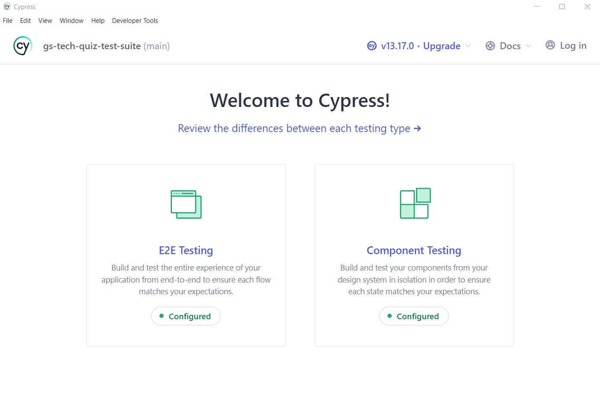
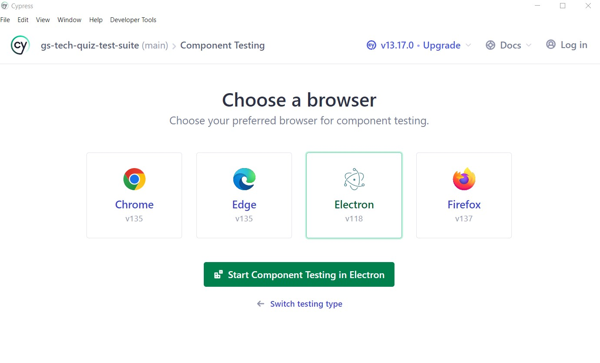
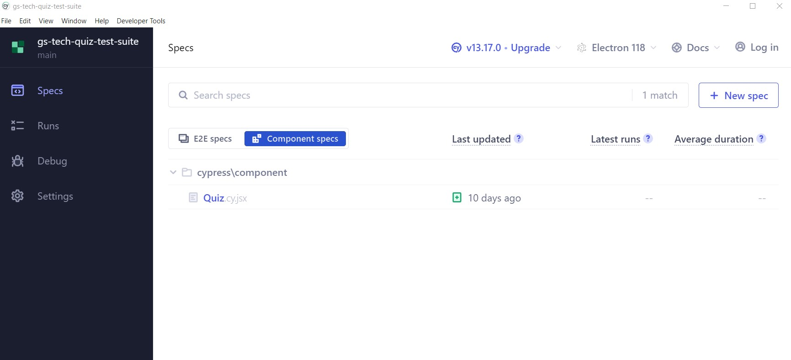
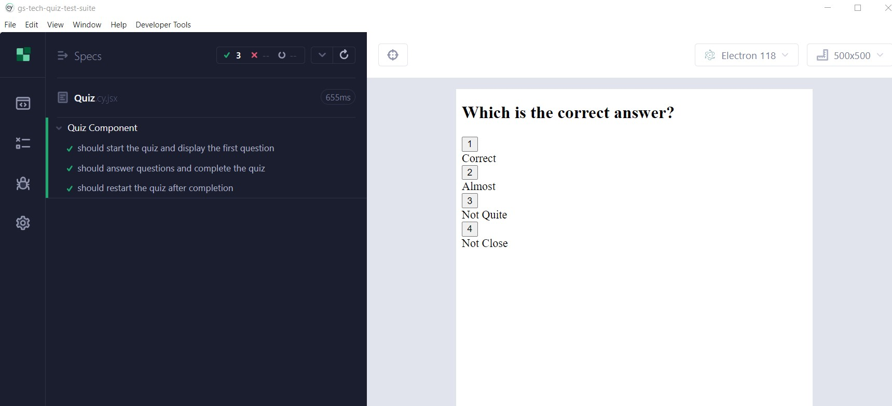
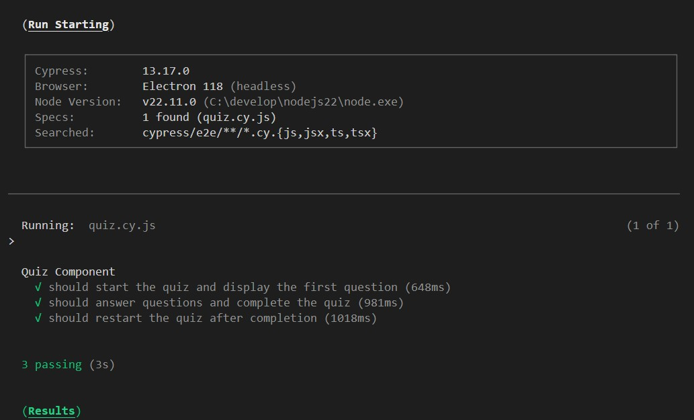
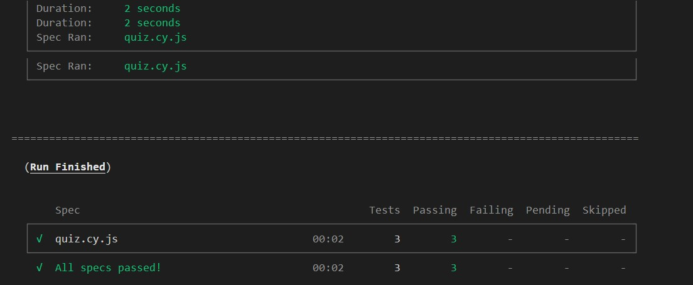

# gs-tech-quiz-test-suite

## [Watch the WALKTHROUGH vide](https://drive.google.com/file/d/1QUmzHCf-Oe4yDGspy-jJYTJ3ATWwTp1b/view?usp=sharing)

Adding test suite using cypress to an existing tech quiz application

### This web application is an online quiz. It uses Cypress to do end-to-end, integration and component testing.

### package json script to run the testing

> "cypress": "npx cypress open",  
> "test": "npx cypress run --browser electron --headless"

## Open browser testing

It uses the following command to do browser testing (a.k.a. headed testing). This is best done while developing and manual testing.

> npx cypress open

Then we use the following command to do the headless testing. This does not open the browser explicitly. This is best used for the purpose of automation, speed and to use less system resources.

As we see, we can do E2E testing and Individual component testing.

If we choose component testing, we are asked to choose the browser.

After this we are given the list of components to choose to be tested.

Once we choose the component to be tested, it runs the test and gives the results.

## Headless testing

> npx cypress run --browser electron --headless

Following are teh two screenshots of the result of this headless testing.

